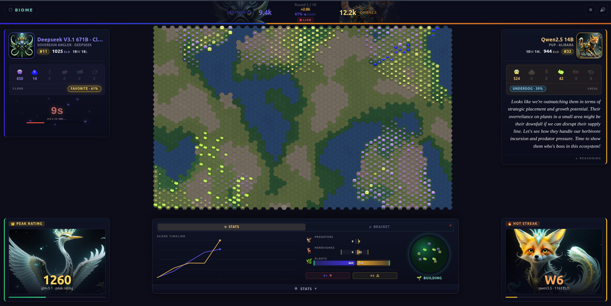
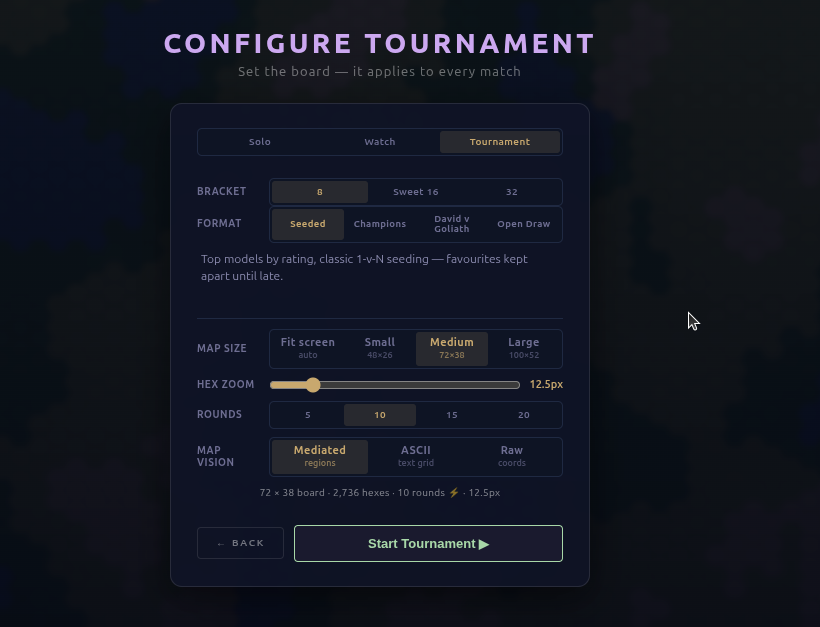
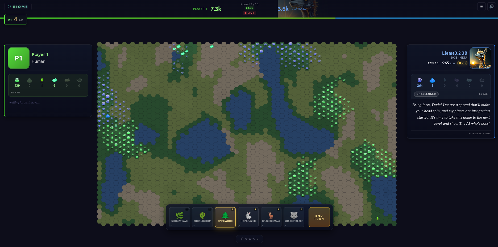
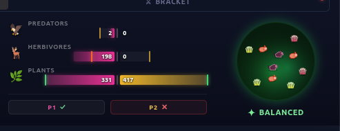
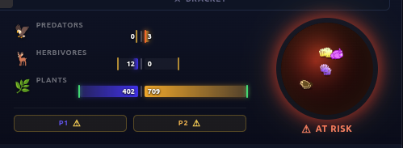
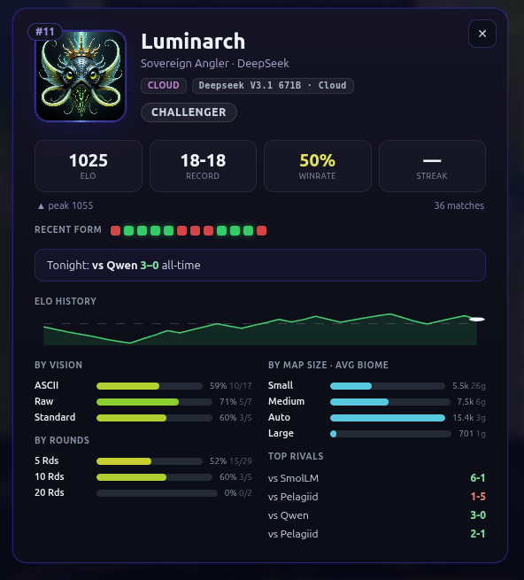
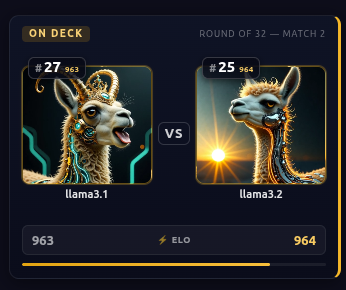
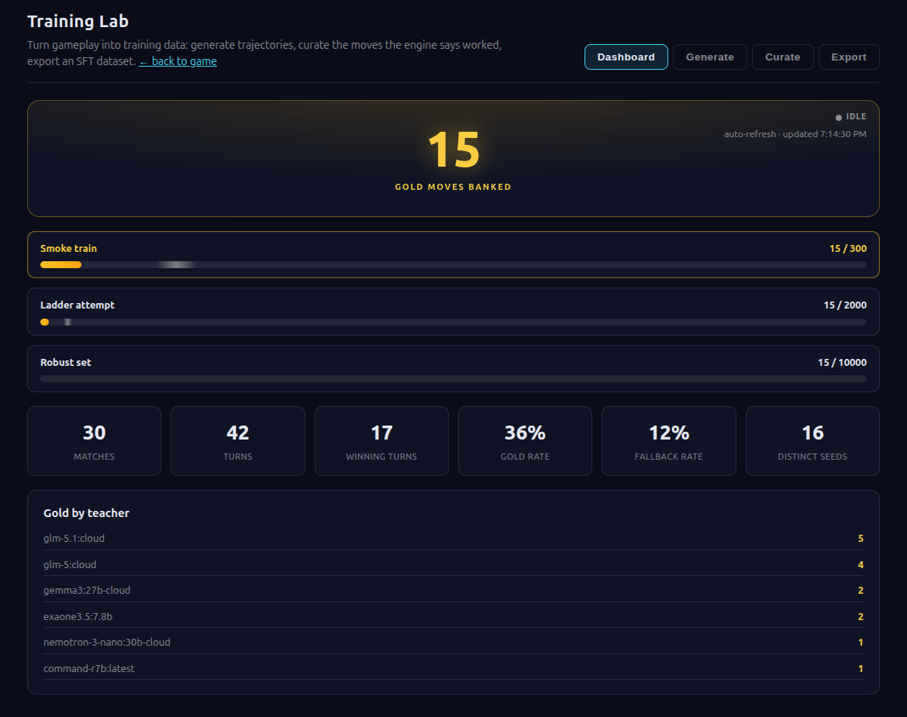

# Biome

A hex-grid ecosystem strategy game where local LLMs (or humans) compete by
seeding species across procedurally generated terrain, then watch a living
simulation decide the winner. Build biodiversity, exploit food chains, raid your
rival's ecosystem — and climb a persistent ELO ladder of AI models.

No API keys. No build step. Everything runs locally on Ollama + a tiny Python
server.

<p align="center">
  
</p>

## Quick Start

```bash
# 1. Install and start Ollama (only needed for AI players)
#    See: https://ollama.com
ollama serve

# 2. Pull at least one model (default is qwen2.5:14b)
ollama pull qwen2.5:14b

# 3. Start the local server (static files + Ollama proxy + ELO backend)
python3 server.py

# 4. Open the game
open http://localhost:8765
```

A pure human-vs-human game needs no Ollama at all.

## Playing a Match

From the launcher you pick a mode:

- **Solo** — you vs an AI model.
- **Watch** — two AI models fight; you spectate (great for the leaderboard).
- **Tournament** — an 8/16/32-model bracket. See [Tournament Mode](#tournament-mode).

Before the match you set the **map size** (Fit / Small / Medium / Large), the
**round count** (5 / 10 / 15 / 20 — default 10), and the AI's **vision** — how
the board is described to the model:

| Vision | What the model sees |
|--------|---------------------|
| **Mediated** | High-level region summary (the default, easiest for small models) |
| **ASCII** | A text grid of the board |
| **ASCII Extended** | Layered grids (terrain / yours / enemy); the model targets a bucket and places from the map alone — no suggested-move menu |
| **Raw** | Bare coordinates + free placement (rewards larger models) |

These are the swappable map strategies — see [Board Vision (Map Strategies)](#board-vision-map-strategies)
for how each is built, how fog applies, and their prompt-size cost.

<p align="center">
  
</p>

### Placement Phase

Each round both players take turns placing organisms. You get **4 Action Points
(AP)** per turn. The six species span three trophic tiers:

| Species | Tier | AP | Eats | Notes |
|---------|------|----|------|-------|
| **Sedgeweave** (Grass) | Plant | 1 | Soil nutrients | Fast-spreading groundcover — the cheap foundation |
| **Thornbloom** (Shrub) | Plant | 1 | Soil nutrients | Spreads slowly, banks more energy than grass |
| **Spirewood** (Tree) | Plant | 2 | Soil nutrients | Slow and tall; stores the most energy, shrugs off grazers |
| **Hopgrazer** (Grazer) | Herbivore | 2 | Grass, Shrub | Nimble; prefers the *enemy's* plants |
| **Bramblemaw** (Browser) | Herbivore | 2 | Shrub, Tree | Heavy; the *only* thing that eats trees |
| **Shadestalker** (Predator) | Predator | 2 | Any herbivore | Swift hunter; culls both grazers and browsers |

**The food web:**

```
                 Shadestalker          (predator — hunts ANY herbivore)
                  ╱        ╲
            Hopgrazer     Bramblemaw   (herbivores)
             (grazer)      (browser)
              │   │         │   │
         ┌────┘   └────┬────┘   └────┐
         ▼             ▼             ▼
       Grass    ◄──  Shrub  ──►     Tree         (plants / producers)
     (grazer       (both eat)     (browser
       only)                        only)
         └────────── soil nutrients ──────────┘
```

Grass is grazer-only, Tree is browser-only, and **Shrub is the contested middle**
both herbivores eat — so the two herbivores partition the plant base and only
compete over shrubs. Predators are generalists with no preference. Plants are pure
producers: nothing is graze-proof (even trees get browsed), they just bank more
energy to survive more bites.

A hard rule the whole engine respects: **at most 2 plants per cell.**

<p align="center">
  
</p>

### Simulation Phase

After both players act, the ecosystem runs for **20 steps**:

- **Plants** spread to adjacent cells and draw nutrients from the soil.
- **Herbivores** move toward food, graze (preferring enemy plants), and
  reproduce when their energy is high.
- **Predators** hunt herbivores when hungry and breed on successful kills — a
  *sated* predator stalks but won't kill, so it crops prey to its need, not to
  extinction.
- **Organisms** that run out of energy die and **decompose** — their remaining
  energy and body mass return to the cell's soil as nutrients, leaving fertile
  ground where life regrows fastest. A die-off seeds its own recovery.

Iteration order is deliberately shuffled each step (Fisher-Yates), so no player
gets a positional edge from placement order.

### Scoring

> **Score = Total Biomass × Species Diversity Bonus × Trophic Chain Bonus**

- **Biomass** — the summed energy of your organisms, with **herbivore energy
  counted 2×** and **predator energy 3×**.
- **Species Diversity** — **+10% per unique species** alive (all six = +60%).
- **Trophic Chain** — **+25%** if you have at least one plant, one herbivore,
  *and* one predator alive simultaneously.

**Key insight:** a monoculture of grass loses badly. Diversify early, build a
full food chain, and graze your rival's plants to starve their herbivores.

### Fog of War

During your turn you can't see where your opponent placed organisms *this*
round. It's a correctness invariant, not just UI — the AI prompt is built so a
model never sees the enemy's current-round moves either, in **every** board
[vision](#board-vision-map-strategies) including the exact-coordinate Raw view.

## Biosphere & Trophic Balance

A living **health orb** reads the board every simulation step and shows the
ecosystem's mood at a glance — plants on the outer ring, herbivores in the
middle, predators at the core. It runs on the same trophic assessment the AI
sees, so humans and models judge health by one shared truth.

<p align="center">
  
  
</p>

The orb moves through states as the board evolves: **Dormant → Primordial →
Building → Balanced**, then warns when things tip — **Overgrazed**,
**Top-Heavy**, **At Risk**, **Collapsing** — with named alerts like
*HERBIVORES STARVING* or *COLLAPSING*.

The "ideal" pyramid is **not** a fixed ratio — it's *derived* from the energy
economy (see [Ecosystem Design](#ecosystem-design) below) and reweighted by the
species actually on the board, so a tree-heavy base demands a different herd than
a grass one. With the shipped balance it works out near **7 plants : 1 herbivore**
and **~5 herbivores : 1 predator**, but change a breeding rate or a plant's vigor
in `config.js` and the target recalibrates itself.

## Ecosystem Design

Biome's simulation is a small but real **energy economy**, and the balance is
designed from that economy rather than guessed. The intent: a default world that
*behaves like an ecosystem* — one a player or an AI can read on the gauge, steer,
and keep alive — instead of a set of numbers that happen to look plausible.

### The energy economy

Energy enters the world in exactly one place: **soil nutrients**, which regenerate
each step. Everything above flows from there.

```
   soil nutrients ──► plants ──► herbivores ──► predators
        ▲                │            │             │
        └──── decomposition ◄─────────┴─────────────┘
              (death returns energy to the soil)
```

- **Plants** convert soil nutrients into stored energy and spread.
- **Herbivores** graze that energy; **predators** eat herbivores. Each tier
  spends energy every step on **upkeep**, **movement**, and **breeding**.
- **Death isn't a dead end** — decomposition routes a corpse's leftover energy
  and body mass back into the soil, closing the loop. The system isn't a one-way
  drain; it cycles.

### Derived trophic balance

Because every rate is known, the *right* size of each tier can be **computed, not
guessed** (`js/ecobalance.js`). For each step in the chain:

```
prey needed per consumer  =  (consumer's upkeep + breeding cost per step)
                             ───────────────────────────────────────────
                              (food one prey supplies × how much is captured)
```

A predator that breeds faster *demands* more herbivores; a slower-regenerating
soil *supplies* fewer plants per herbivore. The ratio is reweighted by the species
actually on the board (browsers and trees behave differently than grazers and
grass), and it's recomputed live, so editing `config.js` — or applying a
[Game Dynamics](#game-dynamics) preset — shifts the ideal automatically. The human
health orb and the AI prompt read this **same** derived target, so both judge
"healthy" by one shared truth.

### A biome that holds

A naïve predator–prey simulation doesn't settle — it boom-busts. Plants glut,
herbivores explode and overgraze, then everything starves and the board drains to
a lifeless plant monoculture. Biome's balance is tuned against that failure mode
so a reasonably-built board **evolves gracefully across a few turns** — the cadence
the game actually plays at — rather than collapsing inside one. Three things make
that work:

1. **Growth that tracks, not explodes** — spread and breeding rates are tuned so a
   tier grows at a pace the tier beneath it can feed, instead of overshooting and
   crashing through zero.
2. **Predator satiation** — a fed predator stops killing, so the apex crops the
   herd to its need rather than wiping it out.
3. **Decomposition** — die-offs fertilize the ground beneath them, so a thinned
   patch is exactly where life regrows fastest.

This is *graceful*, not frozen: the apex still ebbs and players/AI top it up over
a match — as a real apex predator population would. Balance changes are validated
by running the headless engine for many turns across the presets and watching the
population curves, so a tweak that looks fine on paper is checked against what the
simulation actually does.

### Worlds you can dial

The [Game Dynamics](#game-dynamics) presets are tuned variations on that stable
baseline, each validated to still hold its chain:

| Preset | Feel |
|--------|------|
| **Balanced** | The shipped baseline — a gentle, readable normal world |
| **Lush** | Vigorous flora, rich soil, relaxed predators — big, lively, forgiving |
| **Harsh** | Hungry metabolism, poor soil, slow regrowth — scarce but survivable |
| **Predator's Reign** | Fierce, fast-breeding hunters over a churning prey base |

## AI Players

Biome runs LLMs through **Ollama** as opponents. Each turn the AI module:

1. **Reads the board** — maps terrain regions, censuses organisms by type and
   owner (fog-of-war respected).
2. **Scores candidates** — rates every legal cell for plant / herbivore /
   predator placement.
3. **Builds a prompt** — board summary, ecosystem health, strategic phase
   advice, opponent intel, and a memory of its own last turn.
4. **Calls the model** via the local proxy and parses the JSON reply with a
   3-tier extractor (direct → strip code fences → brace-matching) that's robust
   to chatty models.
5. **Falls back to heuristics** — if the reply is unusable, it plants grass via a
   deterministic scoring formula so the game never stalls.

### Board Vision (Map Strategies)

How the board is *described* to the model is a swappable **map strategy**. All
three live in one registry — `js/map-strategies.js` — shared by the live game
(`js/ai.js`) and the Vision Lab, so the game and the lab always draw the board
the same way. Each strategy varies **only** the map block of the prompt; the
lettered-candidate placement contract is identical across all of them, so a
match's outcome isolates the effect of *presentation* alone (it's tagged per
match as `map_strategy`).

| Strategy | What the model sees | Enemy piece info | Scales with board? |
|----------|--------------------|--------------------|--------------------|
| **Mediated** *(default)* | A coarse 9-region terrain digest | Region-level census + "nearby" hints on candidates — never exact coords | **No** — constant ~200-char digest |
| **ASCII** | A downsampled ~18×10 glyph grid with candidate letters stamped on it | None in the map itself (terrain only); same region census drives intel | **No** — near-constant ~500 chars |
| **ASCII Extended** | Three aligned glyph layers (terrain / yours / enemy) in one bucketed frame; **no candidate menu** — the model names a bucket and the engine snaps to the best legal hex | Enemy creatures shown on their own layer by tier (fog-filtered) — bucket-level, not exact coords | **No** — near-constant ~1.5k chars |
| **Raw** | Every land cell as `(col,row) terrain nutrients [occupants]` + free placement | **Exact `(col,row)`** of every visible organism | **Yes** — linear in land-cell count |

Selection: a match's `matchContext.mapStrategy` wins (the launcher's **Vision**
control sets it; default **Mediated**); if unset, the model's size tier picks —
small/mid get **ASCII**, large/cloud get **Raw**. **ASCII Extended** is explicit
opt-in (not a tier default) — it deliberately removes the pre-scored move menu to
test whether models can play from spatial layers alone.

**Fog of war applies to every strategy, Raw included.** Because Raw exposes exact
coordinates, it must hide the opponent's *current-round* placements or it would
leak the live move to the second mover — so it filters occupants by the same rule
the digested views use (`org._placedRound === round && org.player !== viewer`).

#### Prompt size / context cost

The map strategy dominates how much context a turn needs. Measured end-to-end
(full system+user prompt) on the three board presets — reproduce with
`node tools/measure-prompt-sizes.mjs`:

| Vision | Map block | Full prompt | ~tokens | Notes |
|--------|-----------|-------------|---------|-------|
| Mediated | ~205 ch | ~8.6k ch | **~2,150** | Flat across all board sizes |
| ASCII | ~500 ch | ~9.0k ch | **~2,240** | Flat across all board sizes |
| ASCII Extended | ~1.5k ch | ~9.0k ch | **~2,250** | Flat — three layers, but the dropped candidate menu offsets it |
| Raw (Small 48×26) | 24k ch | 32k ch | **~8,000** | |
| Raw (Medium 72×38) | 53k ch | 61k ch | **~15,300** | |
| Raw (Large 100×52) | 100k ch | 108k ch | **~27,000** | |

The fixed, strategy-independent base prompt (rules, candidates, census,
directives) is ~8.4k chars / ~2,100 tokens — so for Mediated and ASCII the map
costs almost nothing on top.

> **Raw can overflow the context window.** The game sizes Ollama's `num_ctx` to
> the prompt (`ceil(chars/3)`, capped per tier in `config.js` → `MODEL_BUDGETS`).
> Raw's coordinate-heavy dump exceeds **every** tier cap on a Large board (wants
> ~36k, cloud caps at 32k) and the 8k small/mid cap even on a Small board — the
> tail of the prompt gets truncated. This is the quantified reason Raw is the
> opt-in, large/cloud-tier baseline rather than the default, and why
> Mediated/ASCII (which stay near-constant) carry normal play.

### Configuring Models

Toggle a player to AI from the match setup, then pick any model in your Ollama
instance. The default is `qwen2.5:14b`. Open **Manage Models** to see installed
models with sizes, browse a curated recommended list, and **install any of them
with one click** — downloads stream live progress, no terminal needed.

These work well for Biome's structured JSON decisions:

| Model | Size | Notes |
|-------|------|-------|
| `qwen2.5:3b` | ~2 GB | Fast, good for quick matches |
| `qwen2.5:7b` | ~5 GB | Best size/performance ratio |
| `qwen2.5:14b` | ~9 GB | Strong strategy, the default |
| `llama3.1:8b` | ~5 GB | Popular general-purpose model |
| `gemma2:9b` | ~5 GB | Good instruction following |
| `mistral:7b` | ~4 GB | Fast responses |
| `phi3:medium` | ~8 GB | Compact but capable |
| `deepseek-r1:7b` | ~5 GB | Reasoning model, slower but thorough |

**Cloud models** proxied through Ollama work automatically — the AI module
detects them and raises token budgets so they can use the richer Raw vision.

## Rankings, Champions & Fighter Cards

Every AI match is rated — **Solo and Watch games feed the same live ELO ladder
as Tournament play**, one continuous rating history across all modes. The
**server is the source of truth for ELO** (K-factor 32, base 1000) — results POST
to `server.py`, which updates ratings, records the match, and returns the rank
deltas the client animates as rank-change drama (promotions, throne takeovers,
upsets get their own celebration). A ranked game ends on a single-match
dashboard: the score-over-time timeline and each model's ELO-before → ELO-after
move.

The **Hall of Champions** ranks every model that's played: a top-3 podium plus
standings sliced by size, family, and local-vs-cloud. Each model carries a
**biome-creature identity** — its family (Qwen, Llama, Gemma, …) maps to a baked
creature portrait and a signature hue, with a procedural fallback for families
that don't have art yet.

Click any fighter for a full **dossier**: ELO history, recent form, win-splits
by vision / round count / map size, and the head-to-head record against
tonight's opponent.

<p align="center">
  
</p>

## Tournament Mode

Pick **Tournament** to run a bracket:

1. Choose the field size (**8 / 16 / 32**) and a **format**:

   | Format | Field & draw |
   |--------|--------------|
   | **Qualifier** | New/under-played models earn their place — least-tested drawn against solid mid-table vets (never the champ) for a winnable shot |
   | **Seeded** *(default)* | Top models by rating, classic 1-v-N seeding — favourites kept apart until late |
   | **Champions** | Proven (ranked) models only; seeded so the best meet last |
   | **David vs Goliath** | Strongest drawn straight against weakest — round one is all mismatch |
   | **Open Draw** | Random field, random pairings — anything can happen |
   | **Home Turf** | Local models only (no cloud contenders), seeded by rating |

2. Pick **Standard** (classic) or **Lightning** (10-round matches — faster
   brackets).
3. Quarter-Finals → Semi-Finals → Final play out sequentially.

A live bracket panel surfaces every match's state — completed (winner + margin),
live (running scores + round counter), up-next, and pending. Between bouts an
ESPN-style broadcast carousel rotates recaps, dossiers, and leaderboard
snapshots, and the final match gets a full champion-crowning fanfare. Models are
warmed up concurrently with the intro so no turn budget is lost to cold loads.

Every bracket is **kept**: a finished tournament can be re-opened later as a
full-screen replay — the mirrored bracket graphic with any one competitor's path
traced in gold, plus per-match ELO cards and a rating-progression chart. Open it
from a fighter's dossier (Recent Tournaments) or the championship screen.

<p align="center">
  
</p>

## Game Dynamics

A **balance panel** (in Settings) lets you bend the ecosystem live without
touching code. Sliders apply multipliers over the baseline config — plant vigor,
herbivore appetite, predator pressure, soil richness, reproduction — with
presets (**Balanced**, **Lush**, **Harsh**, **Predator's Reign**). Settings
persist in `localStorage` and re-apply idempotently, so resetting always returns
to baseline.

## Field Guide

An in-game **Field Guide** (How to Play) explains every species, who eats whom,
and the scoring formula — all rendered from the same board art and config the
game uses, so it never drifts from the live balance.

## Training Lab

Biome can turn its own matches into fine-tuning data. The **Training Lab**
(`lab/train.html`) captures per-turn trajectories, scores the moves the engine
says actually worked, and exports a provider-neutral SFT dataset — a pipeline for
distilling the reigning champion's play into smaller models. It's research/dev
tooling; the game itself never depends on it.

<p align="center">
  
</p>

## Architecture

```
biome/
├── index.html              # Game shell (loads js/game.js as a module)
├── style.css               # All styling
├── server.py               # HTTP server: static files + Ollama proxy + ELO/trajectory backend
├── db.py                   # SQLite (biome.db) ELO/tournament history — rating_events time-series
├── traj.py                 # Training-data trajectory export
└── js/
    ├── game.js             # Orchestrator: grid/sim/turns, UI, AI loop, round/tournament drama
    ├── config.js           # All tunable constants (grid, terrain, species, scoring, rounds)
    ├── ai.js               # AIPlayer — prompt builder, Ollama calls, robust JSON parsing, fallback
    ├── simulation.js       # Ecosystem engine — spread, feeding, hunting, reproduction, death
    ├── trophic.js          # Shared ecosystem-health read (AI prompt + biosphere orb)
    ├── biosphere.js        # Animated health orb
    ├── game-dynamics.js    # Balance-slider system (multipliers over baseline config)
    ├── codex.js            # In-game Field Guide
    ├── tournament.js       # TournamentManager — match execution, live state, drama
    ├── tournament-format.js# Field sizing, seeding, format definitions
    ├── bracket-tree.js     # Mirrored bracket graphic (one source for live + historical)
    ├── tournament-viewer.js# Full-screen historical/championship tournament view
    ├── match-dashboard.js  # Post-game detail — score timelines + ELO-progression charts
    ├── rankings.js         # ELO fetch/render + tournament-history APIs (server holds the math)
    ├── leaderboard.js      # Hall of Champions
    ├── player-card.js      # Fighter dossier modal
    ├── model-identity.js   # Model-family taxonomy → creature + hue
    ├── model-avatar.js     # Baked portraits + emotion clips + procedural fallback
    ├── broadcast-carousel.js# Rotating tournament flank panels
    ├── capture.js          # Fire-and-forget training-data POSTs (never slows the game)
    ├── species.js          # Organism creation + species queries
    ├── organism-art.js     # Per-species drawing (shared by game + icon lab)
    ├── turn.js             # TurnManager state machine
    ├── grid.js / terrain.js / noise.js  # Hex grid + Simplex-noise terrain
    ├── renderer.js         # Canvas drawing (terrain, fog, highlights)
    └── sound.js            # Synthesized SFX bank
```

### Why the Python server exists

The browser never calls Ollama directly. `server.py` is `SimpleHTTPRequestHandler`
plus three jobs:

1. **CORS proxy** — `/ollama/*` → `http://localhost:11434/*`; model pulls stream
   NDJSON so install progress is live.
2. **ELO backend** — match results POST to `/tournament-result`; the server
   computes ratings (K=32, base 1000) and is the single source of truth. History
   persists in **`biome.db`** (SQLite via `db.py`, migrated once from the old
   `tournament_log.json`), with a `rating_events` row per player per match — the
   time-series every dashboard chart reads. `/rankings`, `/history`,
   `/stats/model`, `/stats/model-tournaments`, `/tournaments`, `/tournament?id=`,
   `/roster`, and `/reset-rankings` round it out.
3. **Training capture** — append-only `/trajectory/*` logs, plus an avatar
   generation bridge for baking model portraits.

### Key dependencies

- **Ollama** — local LLM inference, no API keys.
- **Python 3** — `server.py` is standard library only, no pip installs.
- **A modern browser** — ES modules, no bundler.

## Tuning Game Balance

For permanent changes, everything lives in `js/config.js`:

- **Grid** — `GRID_COLS`, `GRID_ROWS`, `HEX_SIZE` (and the `MAPS` presets)
- **Terrain** — water/fertile/grassland/rocky thresholds, nutrient regen, and the
  decomposition knobs (`DECOMPOSE`, `DETRITUS`, `COMPOST_CAP`)
- **Species** — energy, AP cost, spread chance, diet, reproduction thresholds,
  `huntHunger` (predator satiation)
- **Scoring** — `SPECIES_DIVERSITY_BONUS`, `TROPHIC_BONUS`, weight multipliers
- **Rules** — `TOTAL_ROUNDS`, `ROUND_OPTIONS`, `AP_PER_TURN`, `STEPS_PER_TURN`

You don't have to hand-tune the health gauge to match: `js/ecobalance.js` derives
the ideal trophic ratios from these constants, so the gauge and AI re-target
themselves (see [Ecosystem Design](#ecosystem-design)). After a balance change,
sanity-check it by running a few matches and watching the population curves hold.

For live experiments, use the in-game Game Dynamics panel instead.

## Running Without AI

Set both players to Human for a pure 2-player game — no Ollama needed.
`server.py` only proxies Ollama when an AI actually takes a turn.

## License

MIT
