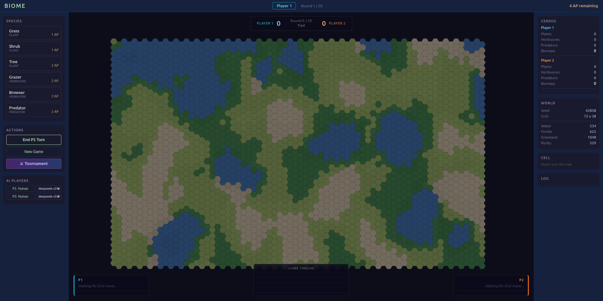
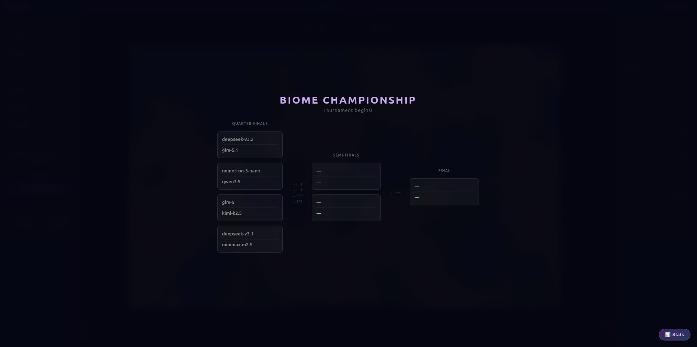
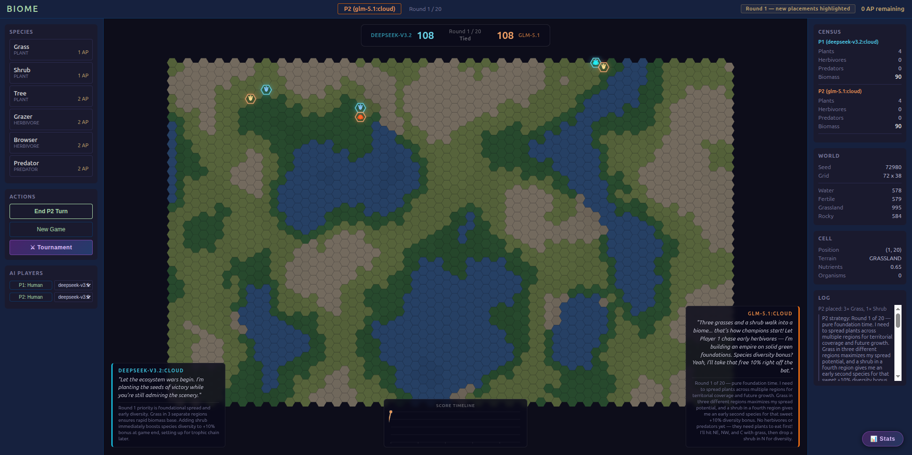

# Biome

A hex-grid ecosystem strategy game where AI models (or humans) compete by placing species across a procedurally generated terrain. Build biodiversity, exploit food chains, and outscore your opponent over 20 rounds.

<p align="center">
  
  
</p>
<p align="center">
  
</p>

## Quick Start

```bash
# 1. Install and start Ollama (if running AI players)
#    See: https://ollama.com
ollama serve

# 2. Pull at least one model (default is qwen2.5:14b)
ollama pull qwen2.5:14b

# 3. Start the local server
python3 server.py

# 4. Open the game
open http://localhost:8765
```

No API keys required. Everything runs locally.

## How to Play

### Placement Phase

Each round, both players take turns placing organisms on the hex grid. You get **4 Action Points (AP)** per turn. Species costs:

| Species | Type | AP Cost | Notes |
|---------|------|---------|-------|
| Grass | Plant | 1 | Fast-spreading, cheap |
| Shrub | Plant | 1 | Heartier than grass |
| Tree | Plant | 2 | Slow to spread, high energy |
| Grazer | Herbivore | 2 | Eats grass & shrubs |
| Browser | Herbivore | 2 | Eats shrubs & trees |
| Predator | Predator | 2 | Hunts herbivores |

### Simulation Phase

After both players act, the simulation runs for 20 steps:

- **Plants** spread to adjacent cells, consume nutrients from terrain
- **Herbivores** move toward food, eat plants (preferring enemy plants), reproduce when energy is high
- **Predators** hunt herbivores, reproduce on successful hunts
- **Organisms** that run out of energy die and are removed

### Scoring

Your score = **Total Biomass** × **Species Diversity Bonus** × **Trophic Chain Bonus**

- **Biomass**: Sum of your organisms' energy values
- **Species Diversity**: +10% for each unique species alive (so 5 species = +50%)
- **Trophic Chain**: +25% if you have at least one plant, one herbivore, AND one predator alive
- **Herbivore energy counts 2×**, **Predator energy counts 3×** in the biomass total

**Key insight**: A monoculture of grass will lose badly. Diversify early, build food chains, and raid enemy ecosystems.

### Fog of War

During your turn, you can't see where your opponent placed organisms this round. Plan accordingly.

## AI Players

Biome uses **Ollama** to run LLMs as AI opponents. The AI system:

1. **Analyzes the board** — maps terrain regions, counts organisms by type and owner
2. **Generates candidates** — scores every empty cell for plant/herbivore/predator placement
3. **Builds a prompt** — includes map summary, ecosystem state, strategic phase advice, and labeled placement options
4. **Calls the LLM** via the local Ollama API — asks for a JSON response picking placements
5. **Falls back to heuristics** — if the LLM fails to return valid JSON, it plants grass using a deterministic scoring formula

### Configuring AI Models

Click the **P1: Human** / **P2: Human** buttons in the sidebar to toggle AI control. A dropdown appears with all models available in your local Ollama instance.

The default model is `qwen2.5:14b`. Click the **⚙ Models** button under the AI Players section to open the model configuration panel, where you can:

- **See installed models** with file sizes
- **Browse recommended models** curated for Biome (good JSON mode + instruction following)
- **Install models with one click** — downloads via Ollama with real-time progress

### Recommended Models

These work well for Biome's structured JSON decision-making:

| Model | Size | Notes |
|-------|------|-------|
| `qwen2.5:3b` | ~2 GB | Fast, good for quick matches |
| `qwen2.5:7b` | ~5 GB | Best size/performance ratio |
| `qwen2.5:14b` | ~9 GB | Strong strategy, the default |
| `llama3.1:8b` | ~5 GB | Popular general-purpose model |
| `gemma2:9b` | ~5 GB | Good instruction following |
| `mistral:7b` | ~4 GB | Fast responses |
| `phi3:medium` | ~8 GB | Compact but capable |
| `deepseek-r1:7b` | ~5 GB | Reasoning model, slower but thorough |

All install directly from the config panel — no terminal needed.

### Manual Configuration

To hardcode a default model, edit `js/ai.js`:

```js
this.model = options.model || 'qwen2.5:14b';
```

Any Ollama-compatible model works. Look for:

- **JSON mode support** — models that handle `format: "json"` produce more reliable moves
- **Instruction following** — the AI must follow a specific JSON schema in its response
- **Context window** — the prompt is ~2-3KB per turn, so even small models work

### Cloud Models

The AI module detects cloud-hosted Ollama models and increases token budgets accordingly. If you proxy a cloud model through your local Ollama instance, it should work automatically.

## Tournament Mode

Click the **⚔ Tournament** button to run a bracket elimination:

1. **Select 8 models** from your Ollama instance
2. Pick a mode: **Standard** (20 rounds per match) or **Lightning** (10 rounds per match — faster brackets)
3. **Quarter-Finals** (4 matches) → **Semi-Finals** (2 matches) → **Final** (1 match)
4. Live bracket panel surfaces per-match state: completed (with winner + score margin), live (with running scores and round counter), up-next, queued, and pending slots
5. Round recap and a championship transition card mark the climax of each match
6. Stats panel tracks per-model win rate, average score, ELO ranking, and best species composition

Matches run sequentially. The AI thinking overlay shows which model is making each move, and audio cues mark callouts, recaps, and round transitions.

## Architecture

```
biome/
├── index.html          # Game UI
├── style.css           # All styling
├── server.py           # HTTP server + Ollama CORS proxy (port 8765)
└── js/
    ├── game.js         # Main game class, UI binding, AI orchestration, round-end sequencer
    ├── config.js       # All tunable constants (grid, terrain, species, scoring)
    ├── ai.js           # AIPlayer — prompt builder, Ollama calls, JSON parsing
    ├── simulation.js   # Ecosystem engine — feeding, spreading, reproduction, death
    ├── species.js      # Organism creation and species queries
    ├── turn.js         # TurnManager state machine
    ├── grid.js         # HexGrid with flat-top hexagons (even-q offset)
    ├── terrain.js      # Procedural terrain via Simplex Noise
    ├── tournament.js   # TournamentManager — bracket, match execution, live state, stats
    ├── rankings.js     # Per-model ELO rankings and tournament history
    ├── sound.js        # Synthesized SFX bank (callouts, recap, round transitions)
    ├── renderer.js     # Canvas rendering — terrain, organisms, fog, highlights
    └── noise.js        # Simplex noise implementation
```

### Key Dependencies

- **Ollama** — runs LLM inference locally, no API keys needed
- **Python 3** — for `server.py` (standard library only, no pip installs)
- **Browser** — ES modules, no build step required

### Server

`server.py` does two things:

1. Serves static files from the project directory
2. Proxies `/ollama/*` requests to `http://localhost:11434/*` to bypass CORS restrictions

This means the browser never talks to Ollama directly — all calls go through the local proxy on port 8765.

## Tuning Game Balance

All game parameters live in `js/config.js`:

- **Grid size**: `GRID_COLS`, `GRID_ROWS`, `HEX_SIZE`
- **Terrain**: thresholds for water/fertile/grassland/rocky, nutrient regen rates
- **Species stats**: energy, cost, spread chance, diet, reproduction thresholds
- **Scoring**: diversity bonus, trophic bonus, weight multipliers
- **Game rules**: `TOTAL_ROUNDS`, `AP_PER_TURN`, `STEPS_PER_TURN`

## Running Without AI

Set both players to "Human" for a pure 2-player game. No Ollama connection is needed — `server.py` only proxies Ollama calls. The game works entirely without AI players.

## License

MIT